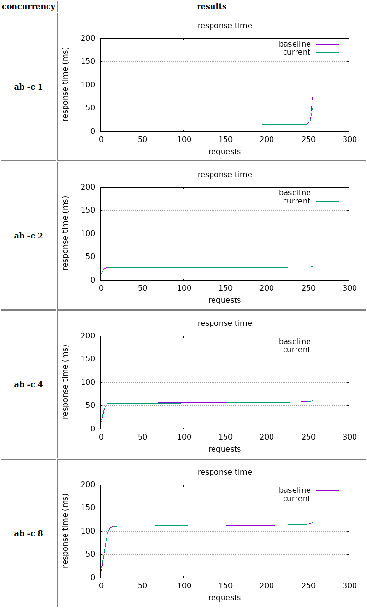

# Requirements

Most, if not all, the required software is available in modern Linux distributions.

 - https://curl.se/ for some basic requests.
 - https://httpd.apache.org/docs/2.4/programs/ab.html for running the benchmarks. Depending on your distro/OS, the package will have a different name, some examples are `apache2-utils` or `httpd-tools`.
 - http://www.gnuplot.info/ for plotting the graphs for the benchmarks.
 - https://www.gnu.org/software/make/ for automating some of the scripts.

# Installation

The recommended way to install the dependencies and run the server is to use a Python virtual environment. This should
work with Python 3.8+.

```sh
python3.8 -m venv .venv
. .venv/bin/activate
pip install -e .  # The `-e .` allows you to edit the code and test it without reinstalling it.
```

# Running the server

Once you have the virtual environment activated and the dependencies installed, you can run the server with:

```sh
tiny_data_server
```

The server will listen at http://0.0.0.0:8888.


# Quick test

You can test everything is working by doing a POST request with the sample NDJON file:

```sh
curl -w '\ntotal request time=%{time_total}\n' --data-binary @nyc_taxi_example.ndjson http://0.0.0.0:8888
{"result": {"status": "ok", "stats": {"bytes": 36530, "records": {"valid": 100, "invalid": 0, "total": 100}}}}
```

# Hot code reloading

If you plan to edit and test your changes, you can set the PYTHONDEBUG environment variable to reload the server as you
change the code.

```sh
PYTHONDEBUG=1 tiny_data_server
```

# Benchmarks

As stated in the [README.md](README.md), the server performance is affected by the level of concurrency. There are some
companion scripts to display some basic performance numbers.

You can create the required files and run the benchmarks with the following command:

```sh
make clean all baseline benchmark
```

Once it finishes, you can open the [benchmark.html](benchmark.html) file in your web browser to have a more visual
representation of the results in the format of some basic graphs. See an example below.

From now on, to test how your changes affect the performance, you just need to run the `benchmark` target as you already have the baseline created.

```sh
make benchmark
```

Example:


